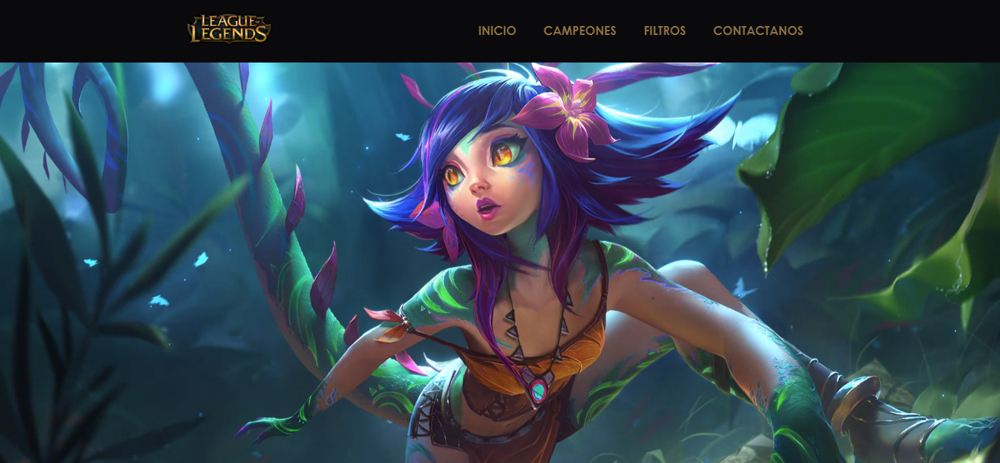

# Data Lovers - LOL(League of Legends)
***
## Índice

* [Proyecto](#proyecto)
* [Descripción del Juego](#temática-Elegida)
* [Usuarios](#principales-usuarios)
* [Objetivos](#objetivos-del-usuario)
* [Historias de Usuario](#historias-de-usuario)
* [Uso del producto](#¿Cuándo-se-utilizaría-el-producto?)
* [La Solución](#solución-al-problema)

## Proyecto

El presente proyecto es el segundo a realizar en el Bootcamp 2018-2, y está basado en _procesar_, _filtrar_ y _ordenar_ la data, así como _calcular_ estadísticas.
En el mundo de la web es muy común el uso de data. De hecho, wikipedia nos dice que un dashboard puede ser un resumen gráfico de varias piezas de información importante, generalmente utilizadas para dar una visión general de una empresa o de un servicio.
Además, este proyecto se debe "resolver" en parejas, por lo que un objetivo importante es ganar experiencia en trabajos colaborativos con entrega grupal.

## Temática Elegida

[League of Legends] (https://lan.leagueoflegends.com/es/game-info/get-started/what-is-lol/) (también conocido por sus siglas LoL) es un videojuego del juego de género multiplayer online battle arena (MOBA) y deporte electrónico desarrollado por Riot Games para Microsoft Windows y OS X.

Fue diseñado para el sistema operativo Microsoft Windows y lanzaron una beta para OS X dejando al poco tiempo el proyecto de lado. Esta beta ha sido mejorada por parte de usuarios del juego, haciendo posible jugar a una versión actualizada de League of Legends.

**El juego está inspirado en un popular mapa personalizado del Warcraft III**, Defense of the Ancients: Allstars diseñado por Steve «Guinsoo» Feak el cual a su vez está basado en el escenario de StarCraft «Aeon of Strife».

## Principales Usuarios

Los principales usuarios son los jugadores tanto nuevos como antiguos de League of Legends (LOL), quienes al jugar siempre seleccionan a un campeón sin conocer sus ventajas y desventajas, al menos que ya lleven jugando con el mismo campeón muuuucho tiempo; pero es imposible poder lograr jugar con todos los campeones y así conocerlos, ¡es ahí donde entramos nosotras!

## Objetivos del Usuario

Los objetivos del usuario es tener una interfaz web donde pueda visualizar y manipular data a su conveniencia para así poder usarlo a su favor mientras juegue; pueda conocer ventajas y desventajas de cada jugador mediante tablas gráficos y estadísticas.

Por ello, es muy importante pensar en el usuario, entender cuál es la mejor manera de visualizar la data según sus necesidades, y plasmar todo eso en nuestro diseño web.

## Historias de Usuario

Se realizaron **encuestas online** a los usuarios involucrados en videojuegos, con la finalidad de conocer datos generales, luego se profundizaron con preguntas de LOL solo a los que lo jugaban actualmente, para conocer las necesidades que ellos tenían, y los requerimientos que necesitaban implementarse en la plataforma web.

Para la encuesta, se preparó una lista de preguntas, y a su vez se diseñó 1 prototipo básico, adaptándolo siempre a las necesidades del usuario.
Algunas de las preguntas generales que hicimos:

### Historias de Usuario generadas

* 	Como jugador de LOL me gustaría saber quiénes son los campeones por medio de una imagen y ordenadamente para poder reconocerlos.
* 	Como jugador de LOL me gustaría poder filtrar los campeones por Rol, para conocer sus habilidades.
* 	Como jugador de LOL me gustaría tener una estadística adicional sobre los ataques.

* 	Como jugador de LOL me gustaría ver las características de los campeones, para así poder conocer quién es el mejor según sus puntajes

## ¿Cuándo se utilizaría el producto?

El producto lo pueden usar tanto como novatos desde un inicio o jugadores antiguos que ya conocen mas de la plataforma, para que así viendo las datas de los campeones puedan elegir el de su mayor conveniencia para un juego más atractivo.

## Solución al problema

Después de conocer a los principales usuarios y entender sus necesidades, se llegó a la decisión de construir una interfaz web que permita visualizar y manipular data, de esta manera resolvería en gran manera el problema del usuario

### *PRIMER SPRINT*

1) Tareas compartidas y organización mediante Trello.

2) Sketch de la solución (prototipo de baja fidelidad).

3) Resultados del primer Sprint
-Barra de Menú integrada.
-Fondo de pantalla (video interactivo).
-Manejo pequeño de Responsive.

#### Testeos de usabilidad
- Al usuario le gusto mucho el fondo en movimiento, pero le gustaria que los campeones se muestren mas ordenados.
- Al usuario le encantaria que tenga una mejor visibilidad en cualquiera de sus dispositivos.
- Al usurario le gustaria ver el menu con letra mas grande.

### *SEGUNDO SPRINT*

Trabajamos en la primera historia de Usuario: Yo como usuario quiero ver los campeones de manera ordenada (nombre e imagen).
Se inició con un manejo del Responsive básico.
Trabajamos un segundo prototipado de baja fidelidad.

#### Testeos de usabilidad
- Al usuario le gusto la manera ordenada en que se muestra a los campeones y la fácil visibilidad. Le gustaria si se pudiese mostrar un poquito mas grande y su nombre también mas grande.
- Al usuario le gustaria poder observar más caractarísticas de su campeon favorito.
- Al usuario le gustaria poder clasificar a sus campeones.

### *TERCER SPRINT*

Trabajamos la segunda historia de Usuario: Yo como usuario quiero poder filtrar a los campeones según su Rol (ordenándolos según orden ascendente y descendente).
Se trabajó en una estadística de ataque según el grupo de campeones por Rol. (promedios).

#### Testeos de usabilidad
- Al usuario le gusto mucho poder filtrar a sus campeones segun sus roles y la manera ordenada en la que se presentaba.
- Al usuario le gusto mucho poder ver la estadística de los ataques según rol, pero le gustaría saber el ataque de cada uno.
- Al usuario le gustaria poder observar un top de los que tiene mas dificultad y ataque.

### COLABORADORAS:

1.	Giuliana Mendoza Suma.
2.	Cinthia Vilcachagua Ccorimanya.
